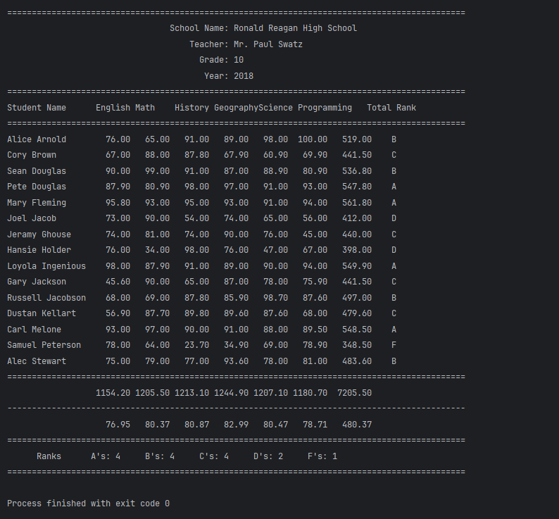

# Student Report Card System
A Java-based student record system that processes performance data for 15 students across six subjects. Utilizing arrays and loops, the application calculates individual total marks and assigns ranks. It further computes class-wide statistics including: subject totals, averages, and grand totals, to generate a formatted report(in table form) complete with school details, students' details and a collective rank summary.
 .
